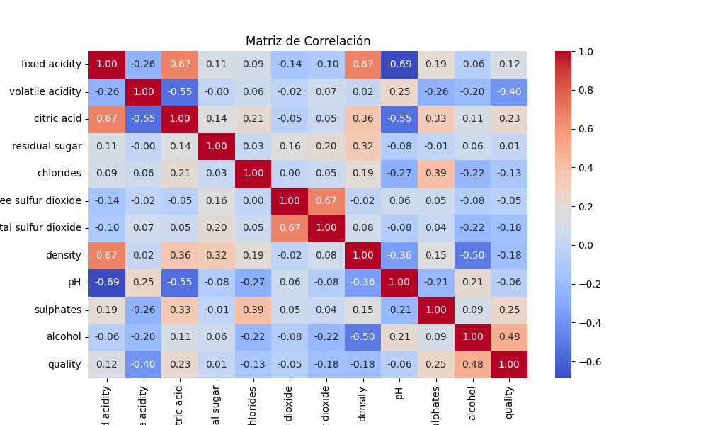
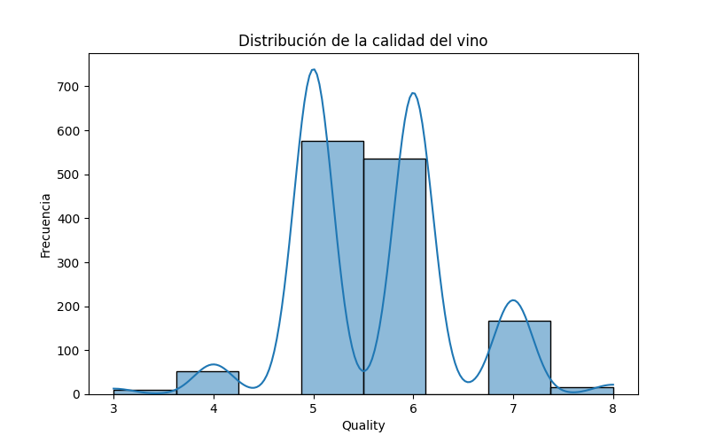
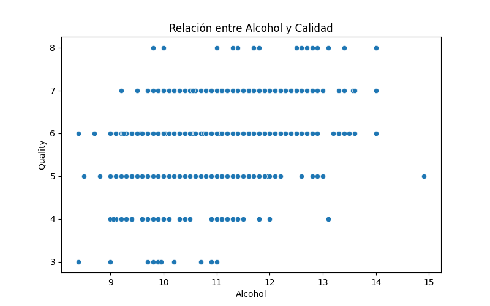
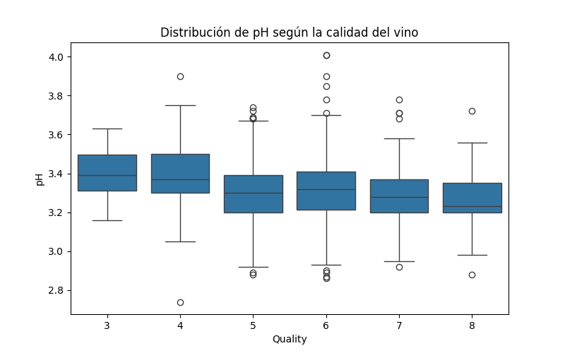

# Universidad de San Carlos de Guatemala

## Facultad de Ingeniería

### Curso Sistemas Organizacionales y Gerenciales

### Christopher Iván Monterroso Alegria   201902363

### Tarea 3 Análisis de Datos de Vino Tinto

## 1. Resumen Estadístico

| Estadístico | fixed acidity | volatile acidity | citric acid | residual sugar | chlorides | free sulfur dioxide | total sulfur dioxide | density |      pH | sulphates | alcohol | quality |
| ------------ | ------------: | ---------------: | ----------: | -------------: | --------: | ------------------: | -------------------: | ------: | ------: | --------: | ------: | ------: |
| **count**    |       1599.00 |          1599.00 |     1599.00 |        1599.00 |   1599.00 |             1599.00 |              1599.00 | 1599.00 | 1599.00 |   1599.00 | 1599.00 | 1599.00 |
| **mean**     |          8.32 |             0.53 |        0.27 |           2.54 |     0.087 |               15.87 |                46.47 | 0.99675 |    3.31 |      0.66 |   10.42 |    5.64 |
| **std**      |          1.74 |             0.18 |        0.19 |           1.41 |     0.047 |               10.46 |                32.90 | 0.00189 |    0.15 |      0.17 |    1.07 |    0.81 |
| **min**      |          4.60 |             0.12 |        0.00 |           0.90 |     0.012 |                1.00 |                 6.00 | 0.99007 |    2.74 |      0.33 |    8.40 |    3.00 |
| **25%**      |          7.10 |             0.39 |        0.09 |           1.90 |     0.070 |                7.00 |                22.00 | 0.99560 |    3.21 |      0.55 |    9.50 |    5.00 |
| **50%**      |          7.90 |             0.52 |        0.26 |           2.20 |     0.079 |               14.00 |                38.00 | 0.99675 |    3.31 |      0.62 |   10.20 |    6.00 |
| **75%**      |          9.20 |             0.64 |        0.42 |           2.60 |     0.090 |               21.00 |                62.00 | 0.99784 |    3.40 |      0.73 |   11.10 |    6.00 |
| **max**      |         15.90 |             1.58 |        1.00 |          15.50 |     0.611 |               72.00 |               289.00 | 1.00369 |    4.01 |      2.00 |   14.90 |    8.00 |

**Observaciones**:

- La variable **alcohol** oscila entre 8.4% y 14.9% con una media de 10.42%.
- El **pH** promedio es 3.31, en un rango típico para vinos tintos (entre 2.74 y 4.01).
- La **calidad** (quality) se concentra en valores de 3 a 8, con una media de 5.64. No existen vinos de calidad 9 o 10 en este conjunto.
- El **residual sugar** tiene un valor máximo de 15.5, lo que indica que algunos vinos pueden ser significativamente más dulces que la mayoría (la media es 2.54).

## 2. Matriz de Correlación

**Puntos destacables**:

- **Alcohol** y **quality** presentan una correlación positiva moderada (~0.48). Es decir, a mayor grado alcohólico, tiende a aumentar la calidad.
- **Volatile acidity** y **quality** tienen una correlación negativa (aprox. -0.39). A mayor acidez volátil, suele disminuir la calidad.
- **Free sulfur dioxide** y **total sulfur dioxide** están fuertemente correlacionados (~0.72), lo cual es lógico dada su relación química.
- **Fixed acidity** y **citric acid** muestran también una correlación positiva notable (alrededor de 0.67).

## 3. Distribución de la Calidad

- La mayor parte de los vinos se ubica en calidades **5** y **6**.
- Hay pocas observaciones con calidad menor a 4 o mayor a 7.
- No existen vinos de calidad 9 o 10 en este dataset.

## 4. Relación entre Alcohol y Calidad

- El gráfico de dispersión sugiere que, a medida que aumenta el contenido de **alcohol**, tiende a aumentar la **calidad**.
- Se aprecia un gradiente ascendente (aunque con dispersión significativa).

## 5. Distribución de pH según la Calidad

- El **pH** se concentra en torno a valores entre 3.0 y 3.4.
- No se observa un gran cambio de pH entre calidades, aunque se aprecia un ligero desplazamiento a valores más bajos de pH en vinos de menor calidad.

## 6. Conclusiones e Insights

1. **Calidad predominante en 5 y 6**
   La mayoría de los vinos del conjunto de datos se clasifican en una calidad media (5 y 6). Esto indica que el dataset está concentrado en un rango relativamente estrecho de calidad, sin ejemplos de calidades extremadamente altas (9 o 10).
2. **Alcohol y Calidad**
   La correlación positiva más fuerte con la calidad (0.48) se observa en la variable **alcohol**. En el scatter plot se ve que, en promedio, los vinos con mayor contenido alcohólico suelen obtener una mejor puntuación de calidad.
3. **Sulphates y Calidad**
   Aunque la correlación no es tan fuerte como la del alcohol, los sulfitos (sulphates) muestran cierta correlación positiva con la calidad (aprox. 0.25). Una adecuada gestión de sulfitos puede influir positivamente en la percepción de calidad.
4. **pH Estable**
   El pH no varía drásticamente con la calidad (correlación muy baja), pero se mantiene en un rango típico de 2.7 a 4.0. No obstante, vinos con calidad muy baja o muy alta tienden a presentar valores de pH ligeramente más extremos.
